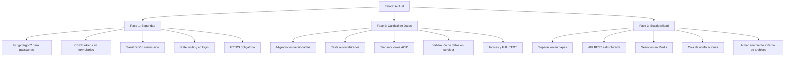

# Registro PQRS v1 — Documentación de Arquitectura de Datos

> **Autor:** orlandoacosta99
>
> **Propósito:** Sistema web de gestión de trámites documentales PQRS (Peticiones, Quejas, Reclamos, Sugerencias). Permite a ciudadanos presentar solicitudes y a colaboradores internos procesarlas y responderlas.

---

## Índice

1. [Diagrama Entidad-Relación](#1-diagrama-entidad-relación)
2. [Diccionario de Datos](#2-diccionario-de-datos)
3. [Reglas de Negocio](#3-reglas-de-negocio)
4. [Flujo de Datos](#4-flujo-de-datos)
5. [Modelo de Seguridad de Datos](#5-modelo-de-seguridad-de-datos)
6. [Ciclo de Vida de los Datos](#6-ciclo-de-vida-de-los-datos)
7. [Stored Procedures](#7-stored-procedures)
8. [Índices y Rendimiento](#8-índices-y-rendimiento)
9. [Stack Tecnológico](#9-stack-tecnológico)
10. [Instalación](#10-instalación)
11. [Recomendaciones del Arquitecto](#11-recomendaciones-del-arquitecto)

---

## 1. Diagrama Entidad-Relación

```
┌─────────────────────────────────────────────────────────────────────────────┐
│                            MODELO DE DATOS - registro_pqrs                  │
├─────────────────────────────────────────────────────────────────────────────┤
│                                                                             │
│  ┌──────────┐       ┌──────────────┐       ┌──────────────┐               │
│  │ tm_rol   │       │ tm_usuario   │       │ tm_area      │               │
│  ├──────────┤       ├──────────────┤       ├──────────────┤               │
│  │PK rol_id │──┐    │PK usu_id     │    ┌──│PK area_id    │               │
│  │ rol_nom  │  │    │ usu_nomape   │    │  │ area_nom     │               │
│  │ est      │  │    │ usu_correo   │    │  │ area_correo  │               │
│  └──────────┘  │    │ usu_pass     │    │  │ est          │               │
│                │    │ usu_img      │    │  └──────┬───────┘               │
│                └────│ rol_id  (FK)─┘    │         │                       │
│                     │ est          │    │         │                       │
│                     └──────┬───────┘    │         │                       │
│                            │            │         │                       │
│                            │   ┌────────┴─────────┴───────┐               │
│                            │   │ td_area_detalle          │               │
│                            │   ├──────────────────────────┤               │
│                            └───│PK aread_id               │               │
│                                │FK usu_id                 │               │
│                                │FK area_id                │               │
│                                │ aread_permi (Si/No)      │               │
│                                │ est                      │               │
│                                └──────────────────────────┘               │
│                                                                           │
│  ┌──────────┐       ┌─────────────────┐       ┌──────────┐               │
│  │ tm_menu  │       │ td_menu_detalle │       │ tm_tramite│               │
│  ├──────────┤       ├─────────────────┤       ├──────────┤               │
│  │PK men_id │──┐    │PK mend_id       │       │PK tra_id │──┐             │
│  │ men_nom  │  │    │FK rol_id        │       │ tra_nom  │  │             │
│  │ men_icon │  └────│FK men_id        │       │ tra_desc │  │             │
│  │ men_ruta │       │ mend_permi(Si/N)│       │ est      │  │             │
│  │ est      │       │ est             │       └──────────┘  │             │
│  └──────────┘       └─────────────────┘                    │             │
│                                                             │             │
│  ┌──────────┐       ┌─────────────────┐       ┌────────────┴──────────┐  │
│  │ tm_tipo  │       │ td_documento_   │       │ tm_documento          │  │
│  ├──────────┤       │ detalle         │       ├───────────────────────┤  │
│  │PK tip_id │──┐    ├─────────────────┤       │PK doc_id              │  │
│  │ tip_nom  │  │    │PK det_id        │       │FK area_id             │  │
│  │ est      │  │    │FK doc_id        │       │FK tra_id              │  │
│  └──────────┘  │    │ det_nom         │       │FK tip_id              │  │
│                │    │FK usu_id        │       │FK usu_id              │  │
│                │    │ det_tipo        │       │ doc_externo           │  │
│                │    │ (documento/     │       │ doc_dni               │  │
│                │    │  respuesta)     │       │ doc_nom               │  │
│                │    │ est             │       │ doc_descrip           │  │
│                │    └────────┬────────┘       │ doc_estado            │  │
│                │             │                │ (Pendiente/Terminado) │  │
│                └──────┐      │                │ doc_respuesta         │  │
│                       │      │                │FK doc_usu_terminado   │  │
│                       └──────┼────────────────│ fech_terminado        │  │
│                              │                │ est                   │  │
│                              │                └───────────────────────┘  │
│                              │                                           │
└──────────────────────────────┴───────────────────────────────────────────┘

Convención: PK = Primary Key, FK = Foreign Key, ──< = 1 a muchos
```

### Matriz de Cardinalidades

| Entidad Origen | Entidad Destino | Cardinalidad | Regla |
|---|---|---|---|
| `tm_rol` | `tm_usuario` | 1:N | Un rol tiene muchos usuarios; un usuario tiene exactamente 1 rol |
| `tm_rol` | `td_menu_detalle` | 1:N | Un rol tiene muchos permisos de menú; permiso pertenece a 1 rol |
| `tm_menu` | `td_menu_detalle` | 1:N | Un menú aparece en muchos roles; detalle pertenece a 1 menú |
| `tm_usuario` | `td_area_detalle` | 1:N | Un usuario puede tener permisos en muchas áreas |
| `tm_area` | `td_area_detalle` | 1:N | Un área puede tener muchos usuarios con permiso |
| `tm_usuario` | `tm_documento` | 1:N | Un usuario puede registrar muchos documentos |
| `tm_tramite` | `tm_documento` | 1:N | Un tipo de trámite puede estar en muchos documentos |
| `tm_tipo` | `tm_documento` | 1:N | Un tipo de documento puede estar en muchos trámites |
| `tm_area` | `tm_documento` | 1:N | Un área puede tener muchos documentos asignados |
| `tm_documento` | `td_documento_detalle` | 1:N | Un documento puede tener muchos archivos adjuntos |
| `tm_usuario` | `td_documento_detalle` | 1:N | Un usuario puede subir muchos archivos |

---

## 2. Diccionario de Datos

### 2.1 Tablas Maestras

#### `tm_rol` — Roles del sistema

| Columna | Tipo | Nulable | PK/FK | Descripción de Negocio |
|---|---|---|---|---|
| `rol_id` | `int(11)` | NO | PK | Identificador único del rol |
| `rol_nom` | `varchar(50)` | NO | — | Nombre del rol: `Persona`, `Colaborador`, `Administrador` |
| `fech_crea` | `datetime` | SI | — | Fecha de creación del registro |
| `fech_modi` | `datetime` | SI | — | Fecha de última modificación |
| `fech_elim` | `datetime` | SI | — | Fecha de eliminación lógica |
| `est` | `int(11)` | NO | — | Estado: `1=Activo`, `0=Eliminado` |

**Datos seed:** `(1, Persona)`, `(2, Colaborador)`, `(3, Administrador)`

---

#### `tm_usuario` — Usuarios del sistema (ciudadanos y personal interno)

| Columna | Tipo | Nulable | PK/FK | Descripción de Negocio |
|---|---|---|---|---|
| `usu_id` | `int(11)` | NO | PK | Identificador único del usuario |
| `usu_nomape` | `varchar(90)` | NO | — | Nombre completo del usuario |
| `usu_correo` | `varchar(50)` | NO | UQ | Correo electrónico (único, usado como login) |
| `usu_pass` | `varchar(200)` | SI | — | Contraseña cifrada con AES-256-CBC (nullable para usuarios Google) |
| `usu_img` | `varchar(500)` | SI | — | URL de imagen de perfil (Google OAuth o avatar subido) |
| `rol_id` | `int(11)` | NO | FK → `tm_rol` | Rol asignado al usuario |
| `fech_crea` | `datetime` | SI | — | Fecha de registro |
| `fech_modi` | `datetime` | SI | — | Fecha de modificación |
| `fech_elim` | `datetime` | SI | — | Fecha de eliminación lógica |
| `fech_acti` | `datetime` | SI | — | Fecha de activación de cuenta |
| `est` | `int(11)` | NO | — | Estado: `1=Activo`, `0=Eliminado`, `2=Pendiente` (sin activar) |

**Reglas de negocio:**
- `usu_correo` debe ser único (restricción UNIQUE)
- Si `rol_id = 1` (Persona), requiere activación por email (`est = 2` inicial)
- Si `rol_id IN (2,3)` (Colaborador/Administrador), es creado por un administrador y no requiere activación
- `usu_pass` solo aplica para autenticación tradicional; usuarios Google no almacenan pass

---

#### `tm_area` — Áreas organizacionales

| Columna | Tipo | Nulable | PK/FK | Descripción de Negocio |
|---|---|---|---|---|
| `area_id` | `int(11)` | NO | PK | Identificador único del área |
| `area_nom` | `varchar(50)` | NO | — | Nombre del área (ej: TI, I+D) |
| `area_correo` | `varchar(50)` | SI | — | Correo electrónico del área (notificaciones) |
| `fech_crea` | `datetime` | SI | — | Fecha de creación |
| `fech_modi` | `datetime` | SI | — | Fecha de modificación |
| `fech_elim` | `datetime` | SI | — | Fecha de eliminación lógica |
| `est` | `int(11)` | NO | — | Estado: `1=Activo`, `0=Inactivo` |

---

#### `tm_tipo` — Tipos de documento (clasificación del solicitante)

| Columna | Tipo | Nulable | PK/FK | Descripción de Negocio |
|---|---|---|---|---|
| `tip_id` | `int(11)` | NO | PK | Identificador único |
| `tip_nom` | `varchar(50)` | NO | — | Tipo de persona: `Natural`, `Juridico`, `Otro` |
| `fech_crea` | `datetime` | SI | — | Fecha de creación |
| `fech_modi` | `datetime` | SI | — | Fecha de modificación |
| `fech_elim` | `datetime` | SI | — | Fecha de eliminación lógica |
| `est` | `int(11)` | NO | — | Estado: `1=Activo`, `0=Inactivo` |

---

#### `tm_tramite` — Tipos de trámite (catálogo de servicios)

| Columna | Tipo | Nulable | PK/FK | Descripción de Negocio |
|---|---|---|---|---|
| `tra_id` | `int(11)` | NO | PK | Identificador único |
| `tra_nom` | `varchar(150)` | NO | — | Nombre del tipo de trámite |
| `tra_descrip` | `varchar(300)` | SI | — | Descripción detallada del trámite |
| `fech_crea` | `datetime` | SI | — | Fecha de creación |
| `fech_modi` | `datetime` | SI | — | Fecha de modificación |
| `fech_elim` | `datetime` | SI | — | Fecha de eliminación lógica |
| `est` | `int(11)` | NO | — | Estado: `1=Activo`, `0=Inactivo` |

**Datos seed:** 12 tipos de trámite preconfigurados (PQRS).

---

#### `tm_menu` — Ítems del menú de navegación

| Columna | Tipo | Nulable | PK/FK | Descripción de Negocio |
|---|---|---|---|---|
| `men_id` | `int(11)` | NO | PK | Identificador único |
| `men_nom` | `varchar(200)` | NO | — | Nombre interno del menú |
| `men_nom_vista` | `varchar(200)` | SI | — | Nombre visible al usuario |
| `men_icon` | `varchar(200)` | SI | — | Clase del icono (Boxicons/Feather) |
| `men_ruta` | `varchar(200)` | SI | — | Ruta relativa al archivo de vista |
| `fech_crea` | `datetime` | SI | — | Fecha de creación |
| `fech_modi` | `datetime` | SI | — | Fecha de modificación |
| `fech_elim` | `datetime` | SI | — | Fecha de eliminación lógica |
| `est` | `int(11)` | NO | — | Estado: `1=Activo` |

**Datos seed:** 11 ítems que componen la navegación del sistema.

---

### 2.2 Tabla Transaccional

#### `tm_documento` — Trámites/documentos PQRS (entidad central del negocio)

| Columna | Tipo | Nulable | PK/FK | Descripción de Negocio |
|---|---|---|---|---|
| `doc_id` | `int(11)` | NO | PK | Identificador único del trámite |
| `area_id` | `int(11)` | NO | FK → `tm_area` | Área destino responsable de atender el trámite |
| `tra_id` | `int(11)` | NO | FK → `tm_tramite` | Tipo de trámite (Petición, Queja, Reclamo, Sugerencia, etc.) |
| `tip_id` | `int(11)` | NO | FK → `tm_tipo` | Tipo de documento del solicitante (Natural, Jurídico) |
| `usu_id` | `int(11)` | NO | FK → `tm_usuario` | Usuario que registró el trámite (ciudadano) |
| `doc_externo` | `varchar(50)` | SI | — | Número de documento externo (opcional, ej: referencia del solicitante) |
| `doc_dni` | `varchar(50)` | NO | — | DNI o identificación del solicitante |
| `doc_nom` | `varchar(250)` | NO | — | Nombre completo del solicitante |
| `doc_descrip` | `varchar(500)` | NO | — | Descripción o asunto del trámite |
| `doc_estado` | `varchar(50)` | NO | — | Estado del trámite: `Pendiente` o `Terminado` |
| `doc_respuesta` | `varchar(500)` | SI | — | Respuesta emitida por el colaborador |
| `doc_usu_terminado` | `int(11)` | SI | FK → `tm_usuario` | ID del colaborador que finalizó el trámite |
| `fech_crea` | `datetime` | SI | — | Fecha de creación del trámite |
| `fech_modi` | `datetime` | SI | — | Fecha de última modificación |
| `fech_elim` | `datetime` | SI | — | Fecha de eliminación lógica |
| `fech_terminado` | `datetime` | SI | — | Fecha en que se respondió el trámite |
| `est` | `int(11)` | NO | — | Estado lógico: `1=Activo`, `0=Eliminado` |

**Formato de número de trámite:** `MM-YYYY-ID` (ej: `05-2026-42`), generado mediante stored procedure.

---

### 2.3 Tablas de Detalle (Permisos y Relaciones)

#### `td_area_detalle` — Permisos de usuario por área

| Columna | Tipo | Nulable | PK/FK | Descripción de Negocio |
|---|---|---|---|---|
| `aread_id` | `int(11)` | NO | PK | Identificador único del permiso |
| `usu_id` | `int(11)` | NO | FK → `tm_usuario` | Usuario colaborador |
| `area_id` | `int(11)` | NO | FK → `tm_area` | Área sobre la que se concede permiso |
| `aread_permi` | `varchar(2)` | NO | — | `Si` = tiene permiso, `No` = sin permiso |
| `fech_crea` | `datetime` | SI | — | Fecha de creación |
| `fech_modi` | `datetime` | SI | — | Fecha de modificación |
| `fech_elim` | `datetime` | SI | — | Fecha de eliminación lógica |
| `est` | `int(11)` | NO | — | Estado: `1=Activo`, `0=Inactivo` |

**Regla de negocio:** Un colaborador solo puede ver y responder trámites de las áreas donde `aread_permi = 'Si'`. El administrador gestiona estos permisos.

---

#### `td_menu_detalle` — Permisos de menú por rol

| Columna | Tipo | Nulable | PK/FK | Descripción de Negocio |
|---|---|---|---|---|
| `mend_id` | `int(11)` | NO | PK | Identificador único |
| `rol_id` | `int(11)` | NO | FK → `tm_rol` | Rol destino |
| `men_id` | `int(11)` | NO | FK → `tm_menu` | Ítem de menú |
| `mend_permi` | `varchar(2)` | NO | — | `Si` = visible, `No` = oculto |
| `fech_crea` | `datetime` | SI | — | Fecha de creación |
| `fech_modi` | `datetime` | SI | — | Fecha de modificación |
| `fech_elim` | `datetime` | SI | — | Fecha de eliminación lógica |
| `est` | `int(11)` | NO | — | Estado lógico |

**Regla de negocio:** Define qué opciones del menú lateral son visibles para cada rol. El sidebar se genera dinámicamente según estos permisos.

---

#### `td_documento_detalle` — Archivos adjuntos de documentos

| Columna | Tipo | Nulable | PK/FK | Descripción de Negocio |
|---|---|---|---|---|
| `det_id` | `int(11)` | NO | PK | Identificador único del archivo |
| `doc_id` | `int(11)` | NO | FK → `tm_documento` | Trámite al que pertenece |
| `det_nom` | `varchar(250)` | NO | — | Nombre del archivo en el sistema de archivos |
| `usu_id` | `int(11)` | NO | FK → `tm_usuario` | Usuario que subió el archivo |
| `det_tipo` | `varchar(50)` | NO | — | Clasificación: `documento` (adjunto original) o `respuesta` (adjunto de respuesta) |
| `fech_crea` | `datetime` | SI | — | Fecha de subida |
| `fech_modi` | `datetime` | SI | — | Fecha de modificación |
| `fech_elim` | `datetime` | SI | — | Fecha de eliminación lógica |
| `est` | `int(11)` | NO | — | Estado lógico |

**Reglas de negocio:**
- Almacenamiento físico en `assets/document/{doc_id}/`
- Solo archivos PDF, máximo 2MB cada uno, hasta 5 por trámite
- `det_tipo` diferencia archivos de la solicitud original vs. archivos de la respuesta

---

## 3. Reglas de Negocio

### 3.1 Integridad de Datos

| Regla | Descripción | Implementación |
|---|---|---|
| **Unicidad de correo** | No pueden existir dos usuarios con el mismo `usu_correo` | Restricción UNIQUE en `tm_usuario.usu_correo` |
| **Integridad referencial** | Todas las FK deben apuntar a registros existentes | No hay restricciones FK explícitas en MySQL (motor InnoDB pero sin declaración de FK); la integridad se mantiene a nivel de aplicación |
| **Soft delete universal** | Ningún registro se elimina físicamente | Todas las tablas tienen columna `est` (1=activo, 0=eliminado) y `fech_elim` |
| **Auditoría temporal** | Toda modificación debe registrarse cronológicamente | Columnas `fech_crea`, `fech_modi`, `fech_elim` en todas las tablas |
| **Estado de documento** | Un trámite solo puede estar en `Pendiente` o `Terminado` | Validación en `models/Documento.php` |

### 3.2 Reglas de Acceso

| Regla | Descripción |
|---|---|
| **RBAC por rol** | `Persona` (id=1): solo crea y consulta sus propios trámites. `Colaborador` (id=2): atiende trámites de áreas asignadas. `Administrador` (id=3): acceso completo al sistema |
| **Permiso por área** | Un colaborador solo ve trámites de áreas donde tenga `aread_permi = 'Si'` en `td_area_detalle` |
| **Menú dinámico** | Las opciones del menú lateral se definen por rol mediante `td_menu_detalle` |
| **Activación de cuenta** | Usuarios con rol `Persona` requieren activación por email antes de acceder |

### 3.3 Reglas de Negocio del Trámite

| Regla | Descripción |
|---|---|
| **Nomenclatura** | Cada trámite recibe un número único con formato `MM-YYYY-ID` generado por `sp_l_documento_01` |
| **Adjuntos** | Máximo 5 archivos PDF de hasta 2MB cada uno, subidos mediante Dropzone.js |
| **Notificación** | Al crear un trámite se notifica al usuario y al área destino por email (PHPMailer). Al responder, se notifica al solicitante |
| **Respuesta** | Solo colaboradores con permiso sobre el área del trámite pueden responderlo |
| **Finalización** | Al responder, `doc_estado` cambia a `Terminado`, se registra `doc_usu_terminado` y `fech_terminado` |

---

## 4. Flujo de Datos

### 4.1 Registro de Usuario (Persona)

```
[Formulario] → validación JS → POST controller/usuario.php?op=registrar
    → models/Usuario.php::registrar_usuario()
        → INSERT tm_usuario (est=2, pass cifrada AES-256-CBC)
    → models/Email.php::registrar()
        → Enlace cifrado con openssl (usu_id + timestamp)
        → Envío SMTP (PHPMailer)
    → Usuario recibe email → hace clic → view/confirmar/
        → POST controller/usuario.php?op=activar
            → UPDATE tm_usuario SET est=1, fech_acti=NOW()
```

### 4.2 Registro de Trámite (Flujo Transaccional Principal)

```
[Formulario NuevoTramite + Dropzone]
    → Validación cliente: PDF, ≤2MB, ≤5 archivos
    → POST controller/documento.php?op=registrar (multipart)
        → models/Documento.php::registrar_documento()
            → INSERT tm_documento (area_id, tra_id, tip_id, usu_id, doc_dni, doc_nom, doc_descrip, doc_estado='Pendiente')
            → sp_l_documento_01 genera nrotramite
        → Por cada archivo subido:
            → Mover archivo a assets/document/{doc_id}/
            → models/Documento.php::registrar_detalle()
                → INSERT td_documento_detalle (doc_id, det_nom, usu_id, det_tipo='documento')
        → models/Email.php::enviar_registro()
            → Email al usuario: "Su trámite N° {nrotramite} fue registrado"
            → Email al área destino: "Nuevo trámite asignado"
```

### 4.3 Respuesta a Trámite

```
[Panel GestionarTrámite] → POST controller/documento.php?op=respuesta
    → Verificar permiso: td_area_detalle WHERE usu_id AND area_id AND aread_permi='Si'
    → models/Documento.php::respuesta_documento()
        → UPDATE tm_documento SET doc_respuesta, doc_estado='Terminado', doc_usu_terminado, fech_terminado=NOW()
    → Por cada archivo de respuesta:
        → INSERT td_documento_detalle (det_tipo='respuesta')
    → models/Email.php::respuesta_registro()
        → Email al solicitante: "Su trámite fue respondido"
```

### 4.4 Gestión de Permisos (Inicialización)

```
[Crear colaborador / Crear rol]
    → sp_i_area_01(usu_id)
        → IF NOT EXISTS (SELECT FROM td_area_detalle WHERE usu_id)
            → INSERT todas las áreas con aread_permi='No'
        → ELSE
            → INSERT solo áreas nuevas
    → sp_i_rol_01(rol_id)
        → IF NOT EXISTS (SELECT FROM td_menu_detalle WHERE rol_id)
            → INSERT todos los menús con mend_permi='No'
        → ELSE
            → INSERT solo menús nuevos
```

---

## 5. Modelo de Seguridad de Datos

### 5.1 Autenticación

| Mecanismo | Descripción |
|---|---|
| **Login tradicional** | El usuario envía credenciales → se descifra `usu_pass` con AES-256-CBC y se compara con la entrada → sesión PHP (`$_SESSION`) |
| **Google OAuth 2.0** | Google Identity Services (GIS) → JWT decodificado del lado del servidor → se extraen `name`, `email`, `picture` → registro/login automático |
| **Recuperación de contraseña** | Generación de pass temporal aleatoria (6 caracteres alfanuméricos) → cifrado AES-256-CBC → actualización en BD → envío por email |

### 5.2 Control de Acceso

```
Session contiene: { usu_id, usu_nomape, usu_correo, usu_img, rol_id }

Verificación en cada vista:
  - ¿El usuario tiene sesión activa? (session_start + $_SESSION)
  - ¿El usuario tiene el rol adecuado? (rol_id)
  - ¿El colaborador tiene permiso sobre el área? (td_area_detalle)
  - ¿El menú está habilitado para su rol? (td_menu_detalle)
```

### 5.3 Cifrado

| Elemento | Algoritmo | Clave |
|---|---|---|
| Contraseñas | AES-256-CBC (OpenSSL) | Hardcodeada en `.env`: `RegistroDePQRS` |
| Enlace activación | AES-256-CBC | Misma clave |
| Transporte | No hay HTTPS forzado (depende del servidor) | — |

### 5.4 Headers de Seguridad HTTP (`.htaccess`)

```
X-Frame-Options: DENY
X-Content-Type-Options: nosniff
X-XSS-Protection: 1; mode=block
Referrer-Policy: same-origin
```

---

## 6. Ciclo de Vida de los Datos

### 6.1 Estados de un Usuario

```
Registro ──→ Pendiente (est=2) ──→ Activación email ──→ Activo (est=1)
                                     ↓
                                  Google OAuth ──→ Activo (est=1, sin pass)
                                                     ↓
                                                  Eliminado (est=0) [soft delete]
```

### 6.2 Estados de un Trámite

```
Creación ──→ Pendiente ──→ Respuesta del colaborador ──→ Terminado
                ↓                                              ↓
           Editable                                       Solo lectura
```

### 6.3 Estados de un Permiso

```
Inicialización (sp) ──→ No (aread_permi='No') ──→ Administrador ──→ Si (aread_permi='Si')
  (todos los permisos      (colaborador no puede          (colaborador puede
   inician como 'No')        ver trámites del área)         ver y responder)
```

---

## 7. Stored Procedures

| Procedimiento | Parámetro | Comportamiento |
|---|---|---|
| `sp_i_area_01(xusu_id)` | `INT` — ID del usuario | **Inicialización de permisos de área.** Si el usuario no tiene registros en `td_area_detalle`, inserta todas las áreas activas con `aread_permi = 'No'`. Si ya tiene algunos permisos, inserta solo las áreas que faltan (nuevas áreas creadas después de la última inicialización). Retorna las áreas con su estado de permiso. |
| `sp_i_rol_01(xrol_id)` | `INT` — ID del rol | **Inicialización de permisos de menú.** Misma lógica que `sp_i_area_01` pero sobre `td_menu_detalle` y `tm_menu`. Inserta menús faltantes con `mend_permi = 'No'`. |
| `sp_l_documento_01(xdoc_id)` | `INT` — ID del documento | **Lectura de documento con formato.** Obtiene un documento por ID con JOINs a `tm_area`, `tm_tramite`, `tm_tipo`, `tm_usuario` y conteo de archivos adjuntos desde `td_documento_detalle`. Genera la columna virtual `nrotramite` con formato `MM-YYYY-ID` (ej: `05-2026-42`). |
| `sp_l_documento_02(xusu_id)` | `INT` — ID del usuario | **Listado de documentos por usuario.** Obtiene todos los documentos activos de un usuario con los mismos JOINs que `sp_l_documento_01`. También genera `nrotramite`. |

> **Nota de arquitectura:** Estos SP encapsulan lógica de presentación (formato `nrotramite`) y lógica de inicialización que idealmente debería estar en la capa de aplicación. Se recomienda migrar el formateo a la vista y la inicialización a un servicio.

---

## 8. Índices y Rendimiento

### 8.1 Índices Actuales

Basado en el esquema actual, las tablas usan índices implícitos (PK) pero no se definen índices secundarios explícitos:

| Tabla | Índices Existentes | Cobertura |
|---|---|---|
| `tm_usuario` | PK (`usu_id`), UQ (`usu_correo`) | Búsqueda por login única |
| `tm_documento` | PK (`doc_id`) | Sin índice en FK ni en `doc_estado` |
| `td_area_detalle` | PK (`aread_id`) | Sin índice compuesto en `(usu_id, area_id)` |
| `td_menu_detalle` | PK (`mend_id`) | Sin índice compuesto en `(rol_id, men_id)` |
| `td_documento_detalle` | PK (`det_id`) | Sin índice en `doc_id` |

### 8.2 Índices Recomendados

```sql
-- Búsqueda de documentos por usuario (sp_l_documento_02)
CREATE INDEX idx_documento_usu_id ON tm_documento(usu_id, est);

-- Búsqueda de documentos por área (gestión de trámites)
CREATE INDEX idx_documento_area ON tm_documento(area_id, doc_estado, est);

-- Búsqueda de documentos por estado
CREATE INDEX idx_documento_estado ON tm_documento(doc_estado, est);

-- Permisos de área (verificación de acceso)
CREATE INDEX idx_area_detalle_usuario ON td_area_detalle(usu_id, area_id, aread_permi, est);

-- Permisos de menú (generación de sidebar)
CREATE INDEX idx_menu_detalle_rol ON td_menu_detalle(rol_id, mend_permi, est);

-- Archivos adjuntos por documento
CREATE INDEX idx_documento_detalle_doc ON td_documento_detalle(doc_id, est);

-- Búsqueda de usuario por correo (login)
-- Ya existe UNIQUE en usu_correo
```

### 8.3 Recomendaciones de Rendimiento

| Problema | Impacto | Recomendación |
|---|---|---|
| Sin índices en FK de `tm_documento` | Las búsquedas por área/usuario/estado hacen full scan | Crear índices compuestos sugeridos |
| `LIKE` sin índice fulltext | Búsqueda de trámites es ineficiente | Migrar a índices FULLTEXT en `doc_nom`, `doc_descrip`, `doc_dni` |
| Subida de archivos desorganizada | Los archivos se almacenan sin estructura de respaldo | Implementar sistema de respaldo para archivos en `assets/document/` |
| Sin paginación real en DataTables | Server-side processing sin optimización | Asegurar que DataTables server-side use LIMIT/OFFSET con índices |
| Sesiones en archivos | No escalable a múltiples servidores | Migrar a sesiones en Redis o BD |

---

## 9. Stack Tecnológico

| Capa | Tecnología | Versión |
|---|---|---|
| **Lenguaje** | PHP (sin framework) | 7.4+ / 8.x |
| **Base de datos** | MySQL | 8.0.30 |
| **ORM/DBAL** | PDO con prepared statements | — |
| **Cifrado** | OpenSSL (AES-256-CBC) | — |
| **Email** | PHPMailer | ^6.8 |
| **Frontend CSS** | Bootstrap 5 + Minia Admin Template | 5.x |
| **Frontend JS** | jQuery 3, DataTables, SweetAlert2, Dropzone.js, Validator.js, Choices.js | — |
| **Autenticación social** | Google Identity Services (GIS) | OAuth 2.0 |
| **Dependencias** | Composer | — |
| **Servidor** | Apache (Laragon) | — |

---

## 10. Instalación

### Requisitos del Entorno

- PHP 7.4+ o 8.x con extensiones: PDO, MySQL, OpenSSL, GD, fileinfo
- MySQL 8.0.30
- Composer
- Servidor web Apache

### Pasos

```bash
# 1. Clonar en el servidor web
# 2. Crear base de datos e importar dump
mysql -u root -p -e "CREATE DATABASE registro_pqrs CHARACTER SET utf8mb3 COLLATE utf8mb3_spanish_ci;"
mysql -u root -p registro_pqrs < docs/Backup\ v1.sql

# 3. Instalar dependencias PHP
cd include
composer install
cd ..

# 4. Configurar .env (copiar desde .env.example)
cp .env.example .env
# Editar: DB credenciales, SMTP Gmail (app password), Google OAuth Client ID

# 5. Acceder via navegador
# http://localhost/RegistroPQRS/
```

### Configuración de Email (PHPMailer)

```php
// models/Email.php
$this->SMTPAuth = true;
$this->Username = 'tu_email@gmail.com';
$this->Password = 'tu_app_password';  // App password de Google
$this->setFrom('tu_email@gmail.com', 'Mesa de Partes');
```

---

## 11. Recomendaciones del Arquitecto

### 11.1 Críticas Arquitectónicas

| Aspecto | Problema | Recomendación |
|---|---|---|
| **Cifrado de contraseñas** | AES-256-CBC es cifrado simétrico (reversible), no hash. La clave está hardcodeada en `.env` | Migrar a `password_hash()` con bcrypt/argon2. Las contraseñas nunca deben ser reversibles |
| **Sin migraciones** | El esquema de BD se distribuye como dump SQL manual | Implementar migraciones versionadas (Phinx o similar) |
| **Sin tests** | No hay pruebas automatizadas (unitarias, de integración, de datos) | Implementar PHPUnit + tests de integración contra BD de prueba |
| **Sin control de versiones de BD** | Los SP y tablas se modifican ad-hoc | Versionar cambios de esquema con migraciones |
| **Acoplamiento aplicación-BD** | Los SP contienen lógica de presentación (formato `nrotramite`) | Mover formato a la capa de presentación |
| **Sin transacciones explícitas** | Las operaciones que involucran múltiples INSERTS (documento + detalle) no usan transacciones | Envolver en `BEGIN TRANSACTION` / `COMMIT` / `ROLLBACK` |
| **Capa de datos monolítica** | Los modelos mezclan lógica de negocio, acceso a BD y formateo | Separar en Repositorios + Servicios + DTOs |
| **Sin manejo de concurrencia** | Dos colaboradores podrían responder el mismo trámite simultáneamente | Implementar locking optimista (versión) o pesimista |
| **Sin logging estructurado** | Solo `logs/errors.log` con texto plano | Migrar a logging estructurado (Monolog) con niveles |

### 11.2 Mejoras Propuestas



### 11.3 Modelo de Datos de Referencia (Migración Sugerida)

```sql
-- Tabla de auditoría centralizada
CREATE TABLE sys_auditoria (
    aud_id BIGINT AUTO_INCREMENT PRIMARY KEY,
    aud_tabla VARCHAR(50) NOT NULL,
    aud_registro_id INT NOT NULL,
    aud_accion ENUM('INSERT', 'UPDATE', 'DELETE') NOT NULL,
    aud_valor_anterior JSON,
    aud_valor_nuevo JSON,
    aud_usuario_id INT NOT NULL,
    aud_fecha TIMESTAMP DEFAULT CURRENT_TIMESTAMP,
    INDEX idx_auditoria_tabla (aud_tabla, aud_registro_id),
    INDEX idx_auditoria_fecha (aud_fecha)
);

-- Tabla de sesiones (migración desde archivos)
CREATE TABLE sys_sesion (
    ses_id VARCHAR(128) PRIMARY KEY,
    ses_datos JSON NOT NULL,
    ses_ultimo_acceso TIMESTAMP DEFAULT CURRENT_TIMESTAMP ON UPDATE CURRENT_TIMESTAMP,
    INDEX idx_ultimo_acceso (ses_ultimo_acceso)
);
```

---

